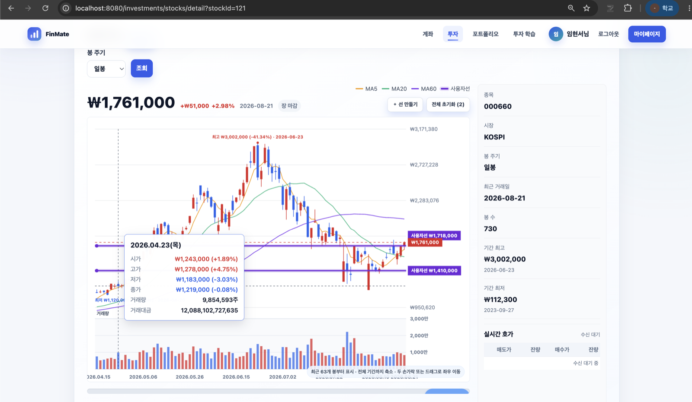
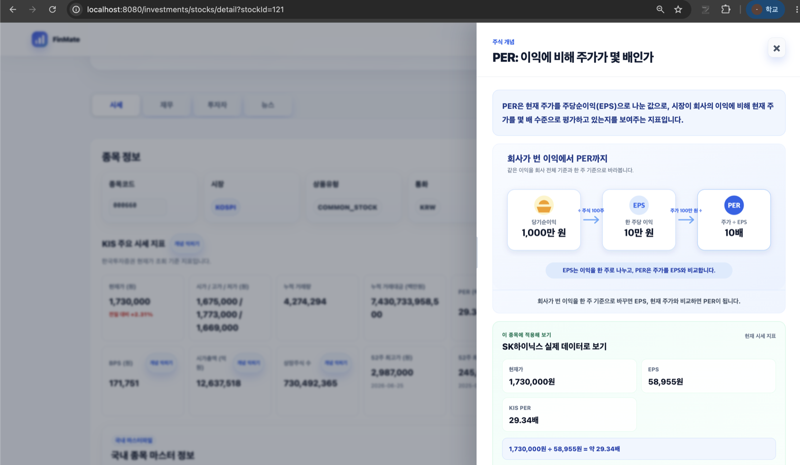
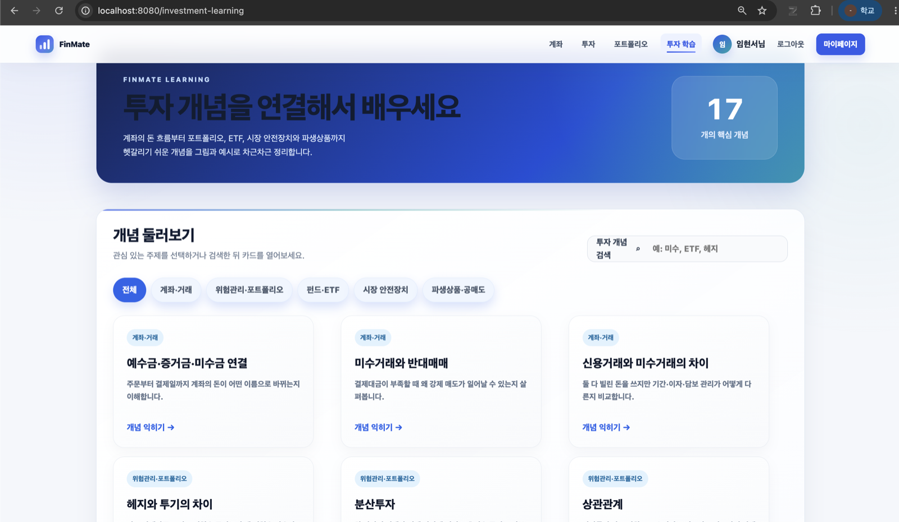
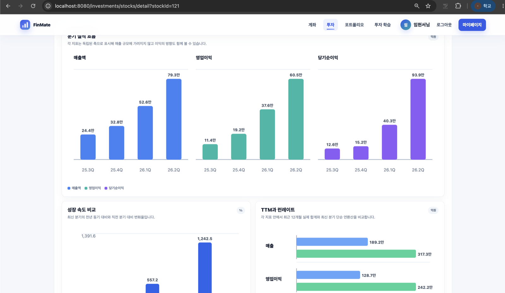
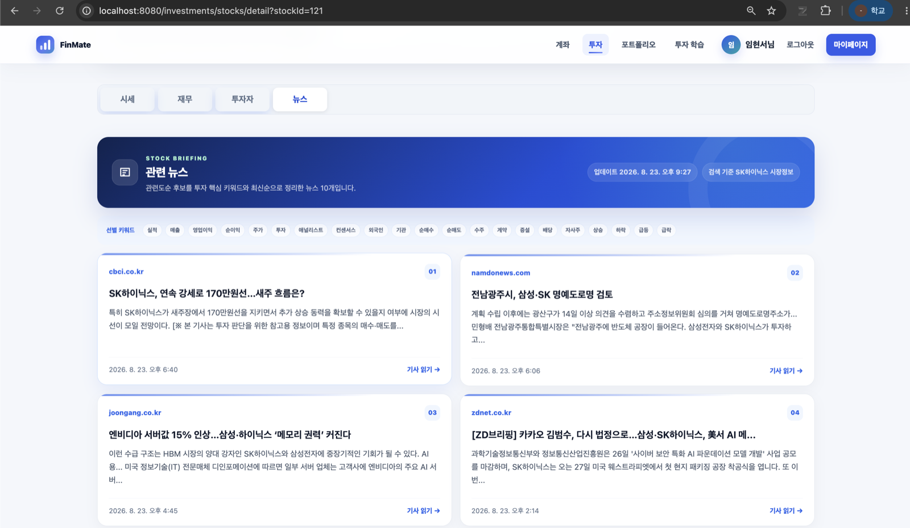
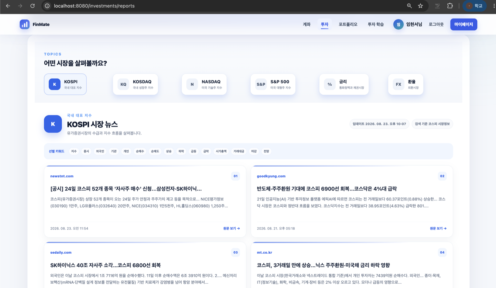
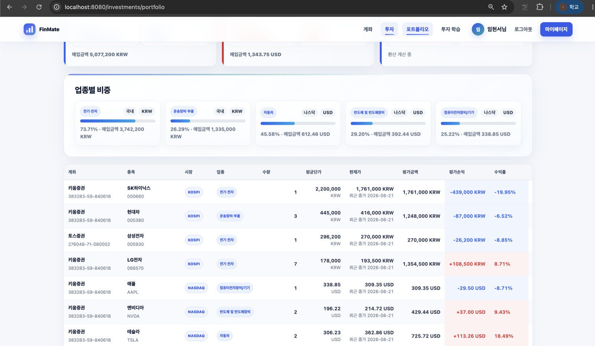
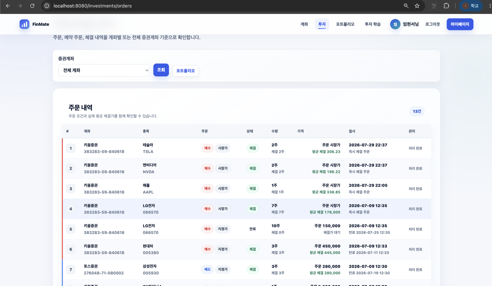
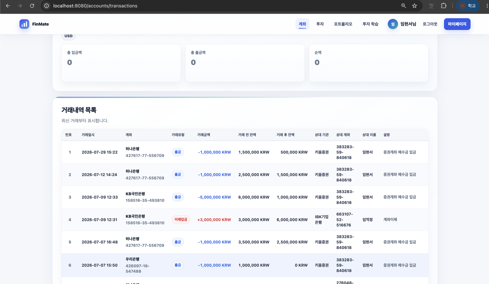

# FinMate

> 차트를 읽고, 투자 지표를 이해하고, 실제 시장 데이터 위에서 안전하게 연습하는 초보 투자자용 금융 학습·모의투자 플랫폼

FinMate는 일반 은행 계좌와 모의 증권 계좌를 연결해 **투자 학습 → 시장 관찰 → 종목 분석 → 모의 주문 → 포트폴리오 복기**를 하나의 경험으로 제공합니다.

> **배포 서비스:** [https://finmate-project.com](https://finmate-project.com)
>
> AWS 운영 환경에 배포되어 있으며 `finmate-project.com` 도메인을 통해 외부에서 HTTPS로 접속할 수 있습니다.

한국투자증권(KIS) Open API의 REST·WebSocket 시세, NAVER 뉴스 검색, Google·Kakao·Naver 소셜 로그인을 연동했으며, 금융 데이터는 `BigDecimal`, 트랜잭션, 비관적 락과 동시성 테스트를 중심으로 다룹니다.

> KIS는 시세·종목·시장 데이터의 출처로 사용합니다. 주문과 체결은 실제 증권사로 전송하지 않고 FinMate DB 안에서 처리되는 **모의 거래**입니다.



## 프로젝트 개요

### 시작하게 된 이유

이 프로젝트는 제가 처음 MTS와 HTS를 사용하면서 느꼈던 어려움에서 출발했습니다. 화면에는 캔들, 이동평균선, 거래량과 수많은 숫자가 한꺼번에 나타났지만 **차트의 봉 하나가 무엇을 의미하는지**, **PER·PBR·ROE 같은 지표를 어떻게 해석해야 하는지**, 그리고 **그 정보를 실제 투자 판단 과정에서 어떻게 연결해야 하는지** 이해하기 어려웠습니다.

용어의 정의를 검색해도 각각의 설명은 흩어져 있었고, 실제 종목 화면에서는 다시 숫자만 보이는 경우가 많았습니다. 개념을 배웠더라도 곧바로 실제 돈을 투자하며 익히기에는 부담이 컸습니다.

FinMate는 이 간격을 줄이기 위해 만들었습니다. 초보 투자자가 어려운 금융 용어와 차트를 쉬운 설명으로 먼저 이해하고, 실제 시장 데이터를 관찰한 다음, **실제 돈이 아닌 가상 자산으로 주문과 체결을 경험하며 주식 투자 과정에 익숙해지는 것**이 프로젝트의 목표입니다.

### 지향하는 경험

FinMate는 특정 종목의 매수·매도를 추천하거나 수익을 예측하는 서비스가 아닙니다. 사용자가 스스로 정보를 읽고 판단하는 방법을 익히는 **투자 학습 샌드박스**를 지향합니다.

- 차트의 시가·고가·저가·종가와 거래량을 직접 움직이며 읽습니다.
- PER·EPS·PBR·BPS·ROE를 쉬운 생활 비유, 정확한 계산식, 실제 국내 종목 값으로 연결합니다.
- 재무제표의 숫자를 표에만 두지 않고 분기 흐름과 성장률 그래프로 비교합니다.
- 뉴스, 투자자 수급, 공매도·대차와 시장 지표를 함께 보며 종목을 여러 관점에서 관찰합니다.
- 시장가·지정가·예약 주문을 가상 자산으로 실행하고, 체결 결과와 포트폴리오 손익을 복기합니다.
- 일반 계좌에서 투자 예수금으로 돈이 이동하고 주문에 잠겼다가 체결·취소되는 전체 자산 흐름을 경험합니다.

## FinMate의 전체 사용자 흐름

| 단계 | 사용자가 하는 일 | FinMate가 제공하는 경험 |
|---|---|---|
| 1. 시작 | 로컬 또는 소셜 로그인 후 일반·투자 계좌 구성 | 다중 통화 계좌, 대표 계좌, 계좌이체와 거래 원장 |
| 2. 학습 | 관심 있는 투자 개념 검색 | 17개 학습 카드와 종목 상세 재무 개념 카드 |
| 3. 관찰 | 시장과 종목 탐색 | 국내·미국 종목 검색, 시장 지표, 랭킹, 관심 종목 |
| 4. 분석 | 차트·재무·수급·뉴스 확인 | KIS 시세, 캔들 차트, 재무 그래프, 키워드 뉴스 Top 10 |
| 5. 연습 | 가상 자산으로 주문 | 시장가·지정가·예약 주문과 실시간 가격 기반 모의 체결 |
| 6. 복기 | 주문 결과와 보유 자산 확인 | 체결 내역, 평가손익, 통화·시장·업종별 포트폴리오 |

이 흐름에서 계좌, 학습, 분석, 주문과 포트폴리오는 분리된 데모 기능이 아닙니다. 일반 계좌의 자금이 투자 계좌 예수금으로 이동하고, 주문 시 예수금이나 보유 수량으로 잠기며, 체결 후 보유 종목과 포트폴리오 평가에 반영되는 하나의 연결된 도메인으로 동작합니다.

## 설계 원칙

- **교육 우선:** 숫자를 많이 보여주는 것보다 숫자의 의미, 계산 방식, 기준 시점과 해석의 한계를 함께 전달합니다.
- **판단 보조:** 낮은 PER이나 높은 ROE를 곧바로 매수 신호로 표현하지 않고 비교 기준과 주의점을 제공합니다.
- **현실적인 연습:** 실제 KIS 시장 데이터를 사용하되 주문은 내부 모의 거래로 처리해 금전적 위험 없이 연습할 수 있게 합니다.
- **연결된 자산 흐름:** 은행형 계좌, 투자 예수금, 주문 잠금, 체결 원장과 포트폴리오를 하나의 흐름으로 관리합니다.
- **금융 정합성:** 금액과 수량은 `BigDecimal`로 계산하고 트랜잭션, 비관적 락, 보존식과 동시성 테스트로 보호합니다.
- **필요한 만큼 수집:** 외부 API 데이터를 무조건 쌓지 않고 화면에 필요한 범위, 시장 세션과 캐시 신선도를 기준으로 동기화합니다.

## 핵심 구현과 차별점

다음은 전체 사용자 흐름을 구현하면서 특히 중요하게 다룬 제품·기술적 선택입니다.

### 1. 필요한 순간에만 KIS 캔들 데이터를 동기화

전 종목의 방대한 차트 데이터를 주기적으로 수집하지 않습니다. 사용자가 종목과 봉 주기를 선택했을 때 저장된 범위를 먼저 확인하고, **부족하거나 오래된 구간만 KIS REST API에서 온디맨드로 가져옵니다.**

```text
차트 조회
  → DB 또는 Redis/JVM 캐시 확인
  → 시장 세션을 고려해 신선도 판단
  → 부족한 구간만 KIS REST 호출
  → 원본 데이터 저장
  → 서버 집계 및 응답
  → 현재 미완성 봉은 KIS WebSocket 체결가로 갱신
```

- 일봉은 최근 3년, 주봉은 최근 10년, 월봉·연봉은 상장 이후 범위를 화면 조회 시 증분 동기화합니다.
- 1분봉 원본은 Redis에 기본 3일간 캐시하고 Redis 장애 시 JVM 캐시로 fallback합니다.
- 3·5·15분봉은 KIS를 다시 호출하지 않고 저장된 1분봉의 OHLCV를 서버에서 집계합니다.
- 종목별 동시 캐시 미스는 하나의 갱신으로 합쳐 불필요한 중복 호출을 줄입니다.
- 차트의 이동평균선, 사용자 가로선, 기간 최고·최저, 거래량과 실시간 현재 봉을 한 화면에서 탐색할 수 있습니다.

### 2. 락 순서를 고정한 안전한 계좌이체

양방향 이체가 동시에 실행되면 두 트랜잭션이 서로의 계좌 락을 기다릴 수 있습니다. FinMate는 요청의 출금·입금 방향과 무관하게, 계좌번호로 찾은 두 계좌의 **DB `Account.id`가 작은 행부터 `PESSIMISTIC_WRITE` 락을 획득**하도록 순서를 고정합니다.

```text
A → B 이체 ─┐
             ├─ min(Account.id) → max(Account.id) 순서로 잠금
B → A 이체 ─┘
```

잔액 변경, `Transfer` 원장 1건, 출금·입금 `AccountTransaction` 2건은 하나의 트랜잭션에서 함께 커밋하거나 롤백됩니다. MySQL 동시성 테스트에서는 반대 방향 이체를 동시에 실행해 완료 여부, 잔액 비음수, 총액 보존과 원장 건수를 검증합니다.

### 3. 숫자를 나열하지 않고 이해시키는 투자 학습

PER 같은 지표를 사전식 정의로만 보여주지 않습니다. 하나의 **빵집을 공동 소유하는 상황**을 EPS → PER, BPS → PBR, 자기자본 → ROE까지 이어서 설명하고, 국내 종목 상세에서는 사용자가 보고 있는 종목의 실제 값과 계산식을 함께 표시합니다.

<p align="center">
  
</p>

- 별도 투자 학습 화면에서 17개의 핵심 개념을 계좌·거래, 위험관리·포트폴리오, 펀드·ETF, 시장 안전장치, 파생상품·공매도 범주로 제공합니다.
- 비유 뒤에는 정확한 정의, 계산식, 기준 시점과 해석할 때의 주의점을 함께 둡니다.
- 낮은 PER처럼 하나의 수치를 곧바로 “좋음”이나 “매수”로 판정하지 않습니다.
- 분기 매출액·영업이익·당기순이익, 성장률, TTM과 런레이트를 그래프로 시각화합니다.

### 4. 단순 최신순이 아닌 키워드 기반 뉴스 Top 10

NAVER API HUB 뉴스 검색에서 종목별·시장 주제별 후보 40건을 가져온 뒤, 투자 판단에 중요한 제목 키워드의 일치 개수로 점수를 계산합니다.

```text
제목 점수 = 제목에 포함된 주요 키워드 수

한국 날짜 최신순
  → 같은 날짜 안에서 키워드 점수 내림차순
  → 발행 시각 내림차순
  → NAVER 원본 순서
  → Top 10
```

종목 뉴스에는 실적, 매출, 영업이익, 순이익, 애널리스트, 외국인, 기관, 순매수, 수주, 계약, 배당, 자사주, 급등·급락 등의 키워드를 사용합니다. 시장 리포트는 KOSPI, KOSDAQ, NASDAQ, S&P 500, 금리, 환율마다 별도 검색어와 키워드 집합을 적용합니다.

최종 Top 10은 MySQL에 기본 6시간 캐시하고, 같은 종목이나 주제의 동시 갱신 요청은 하나로 합쳐 NAVER API 중복 호출을 줄입니다.

### 5. 학습에서 끝나지 않는 연결형 모의투자

FinMate의 학습 기능은 별도의 읽기 자료로 끝나지 않습니다. 학습한 개념을 종목 상세의 실제 데이터에서 확인하고, 같은 종목을 가상으로 주문한 뒤 포트폴리오에서 결과를 다시 살펴볼 수 있습니다.

```text
일반 계좌
  → 투자 계좌로 예수금 입금
  → 종목 분석과 주문 조건 설정
  → 매수 예수금 / 매도 수량 잠금
  → KIS 실시간 가격을 입력으로 내부 모의 체결
  → 체결 원장과 보유 종목 갱신
  → 포트폴리오 평가손익·업종 비중 복기
```

- 국내 KOSPI·KOSDAQ과 미국 NASDAQ 종목을 하나의 검색·포트폴리오 경험으로 제공합니다.
- 시장가, 지정가와 조건 충족 시 일반 주문으로 전환되는 예약 주문을 지원합니다.
- 취소·만료·체결 시 잠긴 예수금과 보유 수량을 함께 정산합니다.
- 포트폴리오는 통화별 손익뿐 아니라 업종별 매입 비중을 제공하고, 실시간 가격이 없으면 최신 종가를 사용합니다.
- 주문과 거래 내역에는 주문 조건, 상태, 평균 체결가와 자산 변경 전후 값을 남겨 결과를 추적할 수 있습니다.

## 주요 화면

<table>
  <tr>
    <td width="50%" align="center"><strong>투자 개념 학습</strong></td>
    <td width="50%" align="center"><strong>분기 재무 분석</strong></td>
  </tr>
  <tr>
    <td></td>
    <td></td>
  </tr>
  <tr>
    <td>검색과 주제 필터로 17개 핵심 개념 탐색</td>
    <td>분기 실적, 성장 속도, TTM·런레이트 시각화</td>
  </tr>
</table>

<table>
  <tr>
    <td width="50%" align="center"><strong>종목별 뉴스 랭킹</strong></td>
    <td width="50%" align="center"><strong>시장 리포트</strong></td>
  </tr>
  <tr>
    <td></td>
    <td></td>
  </tr>
  <tr>
    <td>종목 핵심 키워드 점수 기반 Top 10</td>
    <td>6개 시장 주제별 키워드 랭킹</td>
  </tr>
</table>

<table>
  <tr>
    <td width="50%" align="center"><strong>통합 포트폴리오</strong></td>
    <td width="50%" align="center"><strong>주문·체결 내역</strong></td>
  </tr>
  <tr>
    <td></td>
    <td></td>
  </tr>
  <tr>
    <td>통화·시장·업종별 평가금액과 손익</td>
    <td>시장가·지정가·예약 주문의 상태와 평균 체결가</td>
  </tr>
</table>

<details>
<summary><strong>계좌 거래 원장 화면 더 보기</strong></summary>



</details>

## 구현 기능

| 영역 | 기능 |
|---|---|
| 인증 | 로컬 회원가입·로그인, BCrypt, HTTP Session, Google·Kakao OIDC, Naver OAuth2 |
| 일반 계좌 | 다중 통화 계좌, 대표 계좌, 입출금·계좌이체, 일일 이체 한도, 거래 원장 |
| 투자 계좌 | 증권계좌, 통화별 예수금, 일반↔투자 계좌 자금 이동, KRW/USD 환전 |
| 종목 탐색 | KOSPI·KOSDAQ·NASDAQ 마스터 동기화, 종목·업종 검색, 관심 종목 |
| 종목 분석 | 일·주·월·연·분봉 차트, 이동평균선, 사용자 가로선, 시세·재무·투자자 수급·공매도·대차 |
| 학습 | 17개 일반 투자 학습 카드, 국내 종목 상세의 빵집 비유·실제 값·계산식·해석 주의점 |
| 뉴스 | NAVER 후보 40건, 제목 키워드 스코어링, 종목·시장 주제별 Top 10, DB 캐시 |
| 모의 투자 | 시장가·지정가·예약 주문, 취소·만료, 실시간 가격 기반 체결, 예수금·수량 잠금 |
| 포트폴리오 | 국내·해외 보유 종목, 통화·업종별 비중, 실시간/최근 종가 평가가격 fallback |
| 실시간 | KIS WebSocket 지연 구독, 브라우저 raw WebSocket, 종목 체결가·호가·국내 지수·채팅 |
| 시장 데이터 | KOSPI·KOSDAQ·NASDAQ·S&P 500·금리·USD/KRW, 거래량·거래대금 랭킹 |
| 종목 커뮤니티 | 종목별 실시간 채팅, 이전 기록 조회, 답글, 본인 메시지 수정·소프트 삭제 |
| 품질 검증 | 금융 단위·통합·동시성 테스트, MySQL Testcontainers, GitHub Actions CI |

### 소셜 로그인

Google과 Kakao는 검증된 OIDC `sub`, Naver는 OAuth2 사용자 정보의 `response.id`를 공급자 식별자로 사용합니다. `provider + subject`로 로컬 사용자와 연결하고 인증 상태는 Spring Security의 HTTP Session에 보존합니다. 공급자의 비밀번호와 액세스·리프레시 토큰은 FinMate DB에 저장하지 않습니다.

### 모의 주문과 자산 정합성

- 매수 주문은 통화별 예수금을 `available`에서 `locked`로 이동합니다.
- 매도 주문은 보유 수량 중 주문 수량을 잠급니다.
- 체결·취소·만료는 대상 주문 행을 비관적 락으로 직렬화하며 하나의 종료 경로만 자산을 소비하거나 해제합니다.
- 금액, 가격, 잔액과 수량 계산은 `BigDecimal` 및 통화별 scale·rounding 정책을 사용합니다.
- 실시간 가격이 없을 때 포트폴리오는 DB의 최신 일봉 종가를 우선하고, 부족하면 KIS REST로 보충합니다.

## 아키텍처

```text
React 19 + Vite
  ├─ JSON API ───────────────→ Spring MVC → Service → JPA → MySQL 8.4
  ├─ /ws/stocks ─────────────→ StockRealtimeWebSocketHandler
  ├─ /ws/market-data ────────→ MarketRealtimeWebSocketHandler
  └─ /ws/chat ───────────────→ StockChatWebSocketHandler → MySQL

KIS REST API
  ├─ 종목·업종 마스터, 일·주·월·연·분봉
  ├─ 국내 시세·재무·수급·공매도·대차
  └─ 시장 지표·환율·종목 랭킹 → MySQL / Redis TTL 캐시

KIS WebSocket
  → 지연 연결·목적별 참조 수 관리
  → 종목 체결가·호가 / 국내 지수
  ├─ 브라우저 실시간 전파
  └─ 활성 모의 주문·예약 주문 체결 판단

NAVER News API
  → 후보 40건 → 제목 키워드 스코어링 → Top 10 → MySQL 캐시
```

백엔드는 `controller → service → repository → domain` 계층을 따르며, 외부 연동은 `infra.kis`, `infra.naver` 경계에 둡니다. 잔액·원장·주문 상태 변경은 서비스 트랜잭션 안에서 처리하고, 외부 API 호출 결과를 실제 금융기관의 주문 체결로 표현하지 않습니다.

### AWS 운영 아키텍처

```text
사용자
  → https://finmate-project.com
  → DNS
  → AWS EC2 : 80 / 443
  → Nginx 컨테이너
      ├─ HTTP → HTTPS redirect
      ├─ Let's Encrypt 인증서로 TLS 종료
      ├─ React 정적 파일 제공
      └─ API·OAuth·WebSocket reverse proxy
          → Spring Boot 컨테이너 : 8080 (외부 비공개)
              ├─ MySQL 8.4 컨테이너 + 영구 볼륨
              └─ Redis 7.2 컨테이너 + 영구 볼륨
```

운영 서버는 Docker Compose로 Nginx, Spring Boot, MySQL, Redis를 함께 실행합니다. 외부에는 Nginx의 80·443 포트만 열고 백엔드 포트는 Compose 내부 네트워크에만 둡니다. `finmate-project.com`으로 들어온 HTTP 요청은 HTTPS로 전환되며, React Router 경로는 Nginx가 정적 애플리케이션으로 처리하고 `/api`, OAuth, 로그인과 `/ws` 요청은 Spring Boot로 전달합니다.

## 기술 스택

| 구분 | 기술 |
|---|---|
| Backend | Java 17, Spring Boot 3.5.15, Spring MVC, Spring Data JPA, Bean Validation |
| Security | Spring Security, OAuth2 Client, OIDC, BCrypt, HTTP Session, CSRF |
| Frontend | React 19.2.8, React Router 7.18.2, Vite 8.2.1, ESLint 10.8.1 |
| Database | MySQL 8.4, Hibernate |
| Cache | Redis 7.2, `StringRedisTemplate`, JVM fallback cache |
| Realtime | Spring WebSocket, JDK `HttpClient` WebSocket |
| External API | 한국투자증권(KIS) Open API, NAVER API HUB News API |
| Build & Test | Gradle Wrapper, npm, JUnit 5, Spring Boot Test, Testcontainers |
| Cloud & Deployment | AWS EC2, Amazon ECR, AWS Systems Manager, IAM, STS, GitHub OIDC |
| Infrastructure | Docker, Docker Compose, Nginx, Let's Encrypt, GitHub Actions CI/CD |

## 주요 경로

| 화면 | 경로 |
|---|---|
| 홈·로그인 | `/home`, `/login`, `/signup` |
| 일반 계좌 | `/accounts`, `/accounts/transfer`, `/accounts/transactions` |
| 투자 계좌·환전 | `/investments`, `/investments/transfer`, `/investments/currency-exchange` |
| 종목 검색·상세 | `/investments/stocks/search`, `/investments/stocks/detail?stockId={id}` |
| 종목 랭킹 | `/investments/stocks/market-movers` |
| 포트폴리오·주문 내역 | `/investments/portfolio`, `/investments/orders` |
| 시장 리포트 | `/investments/reports` |
| 투자 학습 | `/investment-learning` |

## 로컬 실행

### 요구 사항

- JDK 17
- Node.js 20.19+ 또는 22.12+와 npm
- Docker 및 Docker Compose
- KIS·OAuth·NAVER 뉴스 기능을 사용할 경우 각 서비스의 유효한 자격 증명

환경변수 전체 예시와 OAuth callback 설정은 [개발 가이드](docs/DEVELOPMENT_GUIDE.md)를 참고하세요. 비밀값은 루트 `.env`에 두며 저장소에 커밋하지 않습니다.

```bash
# MySQL과 Redis
docker compose --env-file .env -f docker-compose.local.yml up -d mysql redis

# Spring API 서버
./gradlew bootRun

# 별도 터미널: React 개발 서버
cd frontend
npm ci
npm run dev
```

브라우저는 `http://localhost:5173`으로 접속합니다. Vite가 React 화면과 정적 자산을 제공하고 `/api`, 인증 경로와 WebSocket 요청만 `http://localhost:8080`의 Spring 서버로 프록시합니다. Gradle은 프런트엔드를 빌드하거나 실행 JAR에 포함하지 않습니다.

## AWS 배포 및 CI/CD

FinMate는 GitHub Actions와 AWS를 연결해 코드 검증, 컨테이너 이미지 생성, private registry 저장, EC2 배포와 애플리케이션 상태 확인까지 자동화했습니다. 운영 서비스는 [https://finmate-project.com](https://finmate-project.com)에서 제공하며, EC2의 Nginx가 HTTPS 종료와 React 정적 파일 제공, Spring Boot reverse proxy를 담당합니다.

### 전체 배포 구조

```text
개발자
  ├─ main 대상 Pull Request
  │    └─ GitHub Actions CI
  │         ├─ Frontend: npm ci → lint → production build
  │         └─ Backend: Gradle 전체 테스트 → 실패 리포트 보관
  │
  └─ main push / workflow_dispatch
       └─ CI 성공
            └─ GitHub Actions CD (`production` Environment)
                 ├─ GitHub OIDC token 발급
                 ├─ AWS STS가 배포 Role의 임시 자격증명 발급
                 ├─ Backend / Frontend-Nginx image build
                 ├─ Amazon ECR에 `sha-<commit SHA>` tag로 push
                 └─ AWS Systems Manager Run Command
                      └─ 대상 EC2의 SSM Agent
                           ├─ Compose·배포 스크립트 설치
                           ├─ EC2 Instance Role로 ECR login·pull
                           ├─ Docker Compose stack 갱신
                           └─ `/api/session` health check

사용자
  → DNS: finmate-project.com
  → EC2 Security Group: 80 / 443
  → Nginx: HTTP→HTTPS, TLS, React, reverse proxy
  → Spring Boot: API / OAuth / WebSocket
  → MySQL / Redis
```

### AWS 구성 요소와 책임

| 구성 요소 | 책임 |
|---|---|
| GitHub Actions | CI 실행, Docker image build, ECR push, SSM 명령 전송과 최종 상태 확인 |
| GitHub OIDC Provider | GitHub workflow의 신원을 AWS가 검증할 수 있는 token 발급 경로 제공 |
| AWS STS | 검증된 OIDC token을 수명이 짧은 IAM 임시 자격증명으로 교환 |
| GitHub 배포 IAM Role | 두 ECR repository에 대한 push와 지정 EC2에 대한 SSM Run Command만 허용 |
| Amazon ECR | Backend와 Frontend-Nginx 운영 이미지를 private repository에 보관 |
| AWS Systems Manager | SSH 접속 없이 지정 EC2에 배포 명령을 전달하고 실행 상태를 제공 |
| EC2 Instance Role | SSM managed node 연결과 private ECR image pull 권한 제공 |
| Amazon EC2 | Nginx, Spring Boot, MySQL, Redis 컨테이너를 Docker Compose로 실행 |
| Nginx + Let's Encrypt | `finmate-project.com`의 TLS 종료, HTTP→HTTPS 전환, 정적 파일 제공과 reverse proxy |

GitHub에서 AWS로 진입하는 배포 Role과 EC2 안에서 사용하는 Instance Role은 분리되어 있습니다. GitHub Role의 권한을 EC2 런타임이 공유하지 않고, EC2도 ECR push나 다른 인스턴스 배포 권한을 갖지 않도록 각 실행 주체에 필요한 권한만 부여합니다.

### 1. CI 실행 조건과 검증 범위

| 이벤트 | 실행 범위 | 운영 반영 |
|---|---|---|
| `main` 대상 pull request | Frontend lint·build, Backend test | 배포하지 않음 |
| `main` push | CI 전체 성공 후 image build와 EC2 배포 | 자동 배포 |
| `workflow_dispatch` | CI 전체 성공 후 image build와 EC2 배포 | 수동 배포 |

CI는 임시 Ubuntu Runner에서 Node.js 22와 Temurin JDK 17을 준비한 뒤 다음 검증을 수행합니다.

```bash
# Frontend
cd frontend
npm ci
npm run lint
npm run build

# Backend
cd ..
./gradlew test --no-daemon --console=plain
```

Backend 통합 테스트는 GitHub Runner의 Docker에서 Testcontainers MySQL 8.4를 실행합니다. 테스트가 실패하면 JUnit XML, HTML 테스트 결과와 Gradle problems report를 GitHub artifact로 업로드해 14일간 보관합니다. 같은 PR에 새 commit이 올라오면 이전 CI는 취소하지만, `main` 배포는 이미 EC2로 전달된 SSM 명령과 경합하지 않도록 실행 중 작업을 취소하지 않고 순서대로 처리합니다.

### 2. GitHub OIDC 기반 AWS 인증

CD job은 GitHub의 `production` Environment를 사용하고 해당 job에만 `id-token: write` 권한을 부여합니다. AWS access key와 secret key를 GitHub에 장기 저장하지 않으며 다음 순서로 인증합니다.

```text
GitHub Actions deploy job
  → GitHub OIDC token 요청
  → AWS STS AssumeRoleWithWebIdentity
  → IAM 신뢰 정책에서 issuer·audience·repository·production Environment 검증
  → 제한된 수명의 AWS 임시 자격증명 발급
  → ECR push와 SSM SendCommand 수행
```

AWS IAM 신뢰 정책은 `production` Environment에서 실행되는 이 저장소의 workflow만 Role을 인수할 수 있도록 `sub`와 `aud` 조건을 제한합니다. workflow는 `allowed-account-ids`로 예상한 AWS 계정인지 다시 확인하고, `aws sts get-caller-identity`를 실행해 실제로 인수한 계정과 Role을 검증합니다.

GitHub `production` Environment에는 비밀값이 아닌 다음 리소스 식별자를 Variables로 등록합니다.

| Variable | 용도 |
|---|---|
| `AWS_ACCOUNT_ID` | 배포 대상 AWS 계정 검증 |
| `AWS_REGION` | ECR·EC2·SSM이 위치한 region |
| `AWS_ROLE_ARN` | GitHub OIDC로 인수할 배포 IAM Role |
| `EC2_INSTANCE_ID` | SSM 명령을 실행할 운영 EC2 한 대 지정 |
| `ECR_BACKEND_REPOSITORY` | Spring Boot image repository |
| `ECR_FRONTEND_REPOSITORY` | React+Nginx image repository |

workflow는 AWS 인증 전에 위 값이 모두 존재하는지 검사하며, 하나라도 비어 있으면 실제 AWS 리소스를 변경하기 전에 배포를 중단합니다.

### 3. Docker 이미지 생성과 ECR 저장

Backend와 Frontend는 서로 다른 multi-stage Docker build로 운영 이미지를 생성합니다.

- Backend는 JDK 17 단계에서 `bootJar`를 생성하고, 최종 JRE 17 이미지에는 실행 JAR만 복사합니다. 애플리케이션은 root가 아닌 `finmate` 사용자로 실행하고 컨테이너 내부의 8080 포트만 사용합니다.
- Frontend는 Node.js 22 단계에서 `npm ci`와 Vite production build를 수행하고, 최종 Nginx 이미지에는 `dist` 정적 파일과 운영용 HTTPS·proxy 설정만 포함합니다.
- 완성된 두 이미지는 `latest` 대신 `sha-<40자리 Git commit SHA>` 태그로 ECR에 push합니다. 실행 중인 이미지가 어느 source commit에서 만들어졌는지 추적할 수 있고 이전 commit 이미지도 명시적으로 선택할 수 있습니다.
- EC2는 source repository를 clone하거나 운영 서버에서 직접 build하지 않습니다. 동일한 CI 산출물을 ECR에서 내려받아 실행하므로 빌드 환경과 운영 환경의 역할을 분리합니다.

```text
Dockerfile.server
  JDK 17 build stage → Spring Boot JAR → JRE 17 runtime image

frontend/Dockerfile.server
  Node.js 22 build stage → React dist → Nginx runtime image

ECR
  ├─ <backend-repository>:sha-<commit>
  └─ <frontend-repository>:sha-<commit>
```

### 4. Systems Manager를 통한 EC2 원격 배포

GitHub Runner는 EC2의 SSH key를 사용하지 않습니다. workflow가 `docker-compose.server.yml`과 `scripts/deploy-server.sh`를 Base64 문자열로 변환해 SSM `AWS-RunShellScript` 명령에 담고, EC2의 SSM Agent가 다음 절차를 실행합니다.

1. `/opt/finmate` 운영 디렉터리를 준비합니다.
2. 전달받은 Compose 파일과 배포 스크립트를 `.next` 임시 파일로 먼저 복원합니다.
3. 완성된 파일만 각각 `0644`, `0755` 권한으로 실제 경로에 설치하고 임시 파일을 제거합니다.
4. AWS region과 새 Backend·Frontend ECR image URI를 배포 스크립트 인자로 전달합니다.
5. 배포 스크립트가 AWS CLI, Docker와 Docker Compose v2 설치 여부를 먼저 확인합니다.
6. 두 image URI가 tag를 포함한 private ECR 형식인지 검증합니다.
7. EC2 Instance Metadata Service가 제공한 Instance Role 임시 자격증명으로 ECR에 로그인합니다.
8. 현재 `.env`를 `.env.before-deploy`로 백업하고 image URI 두 항목만 원자적으로 갱신합니다.
9. `docker compose config --quiet`으로 환경변수 치환과 Compose 문법을 검증합니다.
10. 새 Backend·Frontend 이미지를 pull하고 `docker compose up -d --remove-orphans`로 stack을 갱신합니다.
11. Nginx 컨테이너에서 Spring Boot의 `/api/session`을 최대 약 5분간 확인합니다.
12. SSM 명령의 최종 성공·실패 상태를 GitHub Actions job 결과로 전파합니다.

GitHub Runner는 SSM Command ID를 받은 뒤 10초 간격으로 최대 약 20분 동안 실행 상태를 조회합니다. 운영 로그에 환경 설정이나 외부 API 응답이 포함될 수 있으므로 workflow에는 상세 애플리케이션 로그를 출력하지 않고 SSM의 최종 상태만 노출합니다.

### 5. EC2의 Docker Compose 런타임

| 서비스 | 외부 공개 | 역할 | 데이터 유지 |
|---|---|---|---|
| `nginx` | EC2 80·443 | React 제공, TLS 종료, HTTP redirect, API·OAuth·WebSocket proxy | 인증서는 EC2 `/etc/letsencrypt`를 read-only mount |
| `backend` | 공개하지 않음 | Spring Boot API, 인증, 모의투자와 실시간 처리 | 설정은 `/opt/finmate/.env`에서 주입 |
| `mysql` | 공개하지 않음 | MySQL 8.4 운영 데이터 | `mysql-data` named volume |
| `redis` | 공개하지 않음 | Redis 7.2 cache·실시간 보조 데이터 | AOF와 `redis-data` named volume |

Backend는 Compose 내부 DNS를 통해 `mysql:3306`, `redis:6379`에 연결합니다. Nginx 역시 외부 IP가 아니라 내부 서비스 이름 `backend:8080`으로 Spring Boot에 접근합니다. MySQL과 Redis의 health check가 통과해야 Backend가 시작되며, 컨테이너를 교체하거나 `docker compose down`을 실행해도 named volume은 유지됩니다. `docker compose down -v`는 운영 데이터를 삭제하므로 사용하지 않습니다.

### 6. 도메인, HTTPS와 요청 라우팅

`finmate-project.com` DNS는 운영 EC2의 public IP를 가리킵니다. EC2 앞에 ALB를 두지 않고 Nginx 컨테이너가 직접 80·443 포트를 받아 TLS를 종료합니다.

```text
http://finmate-project.com/*
  → 301 https://finmate-project.com/*

https://finmate-project.com/assets/*
  → Nginx 정적 asset + 장기 cache

https://finmate-project.com/api/*
https://finmate-project.com/oauth2/*
https://finmate-project.com/login/oauth2/*
https://finmate-project.com/ws/*
  → Spring Boot reverse proxy

그 외 경로
  → React Router를 위한 index.html fallback
```

Let's Encrypt 인증서와 개인키는 EC2 호스트의 `/etc/letsencrypt/live/finmate-project.com/`에 두고 Nginx 컨테이너에 read-only로 mount합니다. Nginx는 TLS 1.2와 1.3을 허용하고 원래 요청의 Host, protocol, client IP를 forwarded header로 Spring에 전달합니다. WebSocket 요청에는 Upgrade header와 긴 proxy timeout을 적용합니다.

### 7. 운영 설정과 비밀값 관리

운영 `.env`는 EC2의 `/opt/finmate/.env`에만 보관하며 repository, Docker image, GitHub Actions payload로 전송하지 않습니다. 이 파일에는 MySQL·Redis 비밀번호, OAuth client 정보, KIS·NAVER API 자격 증명처럼 애플리케이션 실행에 필요한 비밀값이 포함됩니다.

배포 과정은 전체 `.env`를 덮어쓰지 않고 아래 두 값만 새 commit의 ECR URI로 갱신합니다.

```dotenv
ECR_BACKEND_IMAGE=<account>.dkr.ecr.<region>.amazonaws.com/<repository>:sha-<commit>
ECR_FRONTEND_IMAGE=<account>.dkr.ecr.<region>.amazonaws.com/<repository>:sha-<commit>
```

갱신 전 파일은 동일한 권한과 소유권을 유지한 `/opt/finmate/.env.before-deploy`로 백업합니다. 임시 파일을 완성한 뒤 원본 위치로 이동하는 방식으로 수정 도중 `.env`가 일부만 작성되는 상황을 방지합니다.

### 8. 상태 확인과 실패 대응

- Nginx 자체 상태는 컨테이너 내부의 `/nginx-health`로 확인합니다.
- 실제 배포 성공 여부는 Nginx 컨테이너에서 Compose 내부의 `http://backend:8080/api/session`을 호출해 판단합니다.
- 첫 요청 실패 후 5초 간격으로 최대 60회 재시도하므로 Spring Boot와 의존 서비스가 준비될 시간을 약 5분까지 허용합니다.
- 검증에 성공하면 현재 컨테이너 상태를 출력하고 SSM·GitHub Actions를 성공으로 종료합니다.
- 제한 시간 안에 성공하지 못하면 컨테이너 상태와 이전 image 값의 위치만 안내하고 실패를 상위 workflow까지 전파합니다.
- 상세 로그는 SSM Session Manager에서 `/opt/finmate`로 이동한 뒤 권한 있는 운영자가 직접 확인합니다.

```bash
cd /opt/finmate
sudo docker compose --env-file .env -f docker-compose.server.yml ps
sudo docker compose --env-file .env -f docker-compose.server.yml logs --tail 100 backend nginx
```

자동 rollback은 수행하지 않습니다. 현재 JPA 설정이 `ddl-auto=update`이므로 새 애플리케이션이 DB schema를 변경한 뒤 이전 이미지를 기계적으로 다시 실행하면 코드와 schema가 불일치할 수 있습니다. 장애 복구 시 `/opt/finmate/.env.before-deploy`의 이전 SHA image를 확인하고 DB 하위 호환성을 검토한 뒤 명시적으로 되돌립니다.

### 배포 관련 파일

| 파일 | 설명 |
|---|---|
| [`.github/workflows/ci.yml`](.github/workflows/ci.yml) | CI, OIDC 인증, ECR push와 SSM 배포 workflow |
| [`Dockerfile.server`](Dockerfile.server) | Spring Boot JAR 생성과 non-root JRE runtime image |
| [`frontend/Dockerfile.server`](frontend/Dockerfile.server) | React production build와 Nginx runtime image |
| [`frontend/nginx.server.conf`](frontend/nginx.server.conf) | `finmate-project.com` HTTPS·정적 파일·reverse proxy 설정 |
| [`docker-compose.server.yml`](docker-compose.server.yml) | EC2의 Nginx·Backend·MySQL·Redis 운영 stack |
| [`scripts/deploy-server.sh`](scripts/deploy-server.sh) | ECR pull, Compose 갱신, health check를 수행하는 EC2 배포 절차 |
| [`docs/CICD.md`](docs/CICD.md) | IAM 정책, GitHub Environment, EC2 최초 준비를 포함한 상세 운영 가이드 |

## 테스트와 검증

```bash
# Frontend
cd frontend
npm run lint
npm run build

# Backend 전체 회귀 테스트
cd ..
./gradlew test

# 전체 빌드와 실행 JAR
./gradlew clean build
./gradlew bootJar
```

MySQL 통합·동시성 테스트는 Testcontainers의 MySQL 8.4를 사용합니다. 같은 검증 명령은 GitHub Actions CI에서도 실행되며, 검증을 통과한 `main` commit만 운영 배포 단계로 진행합니다.

## 현재 범위와 한계

- 실제 은행 송금이나 실제 증권사 주문을 수행하지 않는 학습·모의 거래 프로젝트입니다.
- 부분 체결 상태 모델은 있지만 현재 체결 로직은 남은 수량 전체 체결 기준입니다.
- 거래시간은 주말과 시장 세션을 반영하지만 공휴일·조기폐장 캘린더는 아직 적용하지 않습니다.
- KIS REST token, WebSocket 연결과 최신 실시간 payload는 단일 JVM 메모리 기준입니다.
- JPA 스키마는 `ddl-auto=update`를 사용하며 Flyway/Liquibase는 도입하지 않았습니다.
- 상세한 금융 불변식과 알려진 동시성 위험은 [금융 불변식 문서](docs/FINANCIAL_INVARIANTS.md)를 기준으로 관리합니다.

## 문서

- [프로젝트 개요](docs/PROJECT_OVERVIEW.md)
- [아키텍처](docs/ARCHITECTURE.md)
- [도메인 모델](docs/DOMAIN_MODEL.md)
- [금융 불변식](docs/FINANCIAL_INVARIANTS.md)
- [주식 거래 흐름](docs/TRADING_FLOW.md)
- [KIS 연동](docs/KIS_INTEGRATION.md)
- [종목 상세 재무 학습 카드](docs/STOCK_FINANCIAL_DETAIL.md)
- [개발 가이드](docs/DEVELOPMENT_GUIDE.md)
- [AWS 배포 및 CI/CD 가이드](docs/CICD.md)
