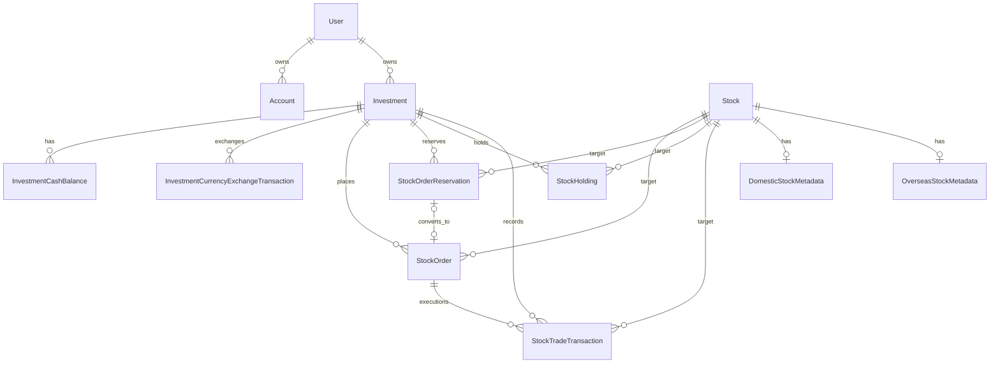

# FinMate 도메인 모델

## 1. 관계 요약

JPA 코드에는 위 관계의 자식→부모 참조가 주로 구현되어 있다. `User.accountList`와 `Investment.cashBalances`를 제외하면 부모의 컬렉션 탐색은 대부분 Repository 쿼리로 수행한다.

## 2. User

사용자 신원과 로그인 자격 정보를 저장한다.

- 주요 필드: `username`, `telephone`, `email`, unique `userId`, 암호화된 `password`
- `Account`와 `OneToMany` 양방향 관계
- `addAccount()`가 양쪽 연관관계를 설정
- `Investment` 목록 필드는 없지만 `Investment.user`를 통해 소유 관계가 성립

## 3. Account

은행형 일반 계좌의 잔액과 이체 정책을 보유한다.

- 사용자, 계좌번호, 통화, 은행 코드, 잔액, 대표 여부
- 통화 정책별 초기 잔액과 1회·일일 이체 한도
- `withdraw()`/`deposit()`에서 양수, 통화 소수 자릿수, 잔액을 검증
- `updateTransferLimit()`에서 1회 한도가 일일 한도를 넘지 않도록 검증

계좌이체 기록은 `Transfer`와 `AccountTransaction`에 분리된다. 요청 자체와 계좌 관점의 원장이 각각 저장된다.

## 4. Investment

모의 증권 계좌다.

- 사용자, unique 계좌번호, 증권사 코드, 대표 여부, 생성 시각
- 생성 시 `CurrencyCode.values()`의 모든 통화에 대한 `InvestmentCashBalance` 생성
- 직접 잔액을 갖지 않고 통화별 예수금 엔티티에 위임
- 보유 종목, 주문, 체결은 각 엔티티가 `Investment`를 참조

## 5. InvestmentCashBalance

투자 계좌 한 개의 특정 통화 예수금을 관리한다.

- `(investment_account_id, currency_code)` unique
- `availableBalance`: 이체·주문에 사용할 수 있는 금액
- `lockedBalance`: 매수 주문·예약으로 묶인 금액
- `lock()`: 사용 가능 금액을 잠금 금액으로 이동
- `releaseLocked()`: 취소·만료 시 반대로 이동
- `settleBuyFromLocked()`: 잠금액에서 실제 매수 정산액을 차감하고 차액을 반환하거나 부족분을 사용 가능 잔액에서 추가 차감
- 환전은 사용 가능 예수금만 대상으로 하며, 환전 전 통화 출금과 환전 후 통화 입금은 같은 트랜잭션에서 처리된다.
- 총 잔액은 두 필드의 합

## 6. InvestmentCurrencyExchangeTransaction

증권계좌 안에서 발생한 KRW/USD 환전 결과를 불변 기록으로 저장한다.

- 증권 계좌, 환전 전/후 통화, 환전 전/후 금액
- 적용 `USD_KRW` 환율
- 환전 전 통화와 환전 후 통화 각각의 거래 전후 사용 가능 예수금 스냅샷
- 생성 시각

환전 처리 시 예수금 락은 환전 방향과 관계없이 항상 `KRW` → `USD` 순서로 획득한다.
환전 기록은 `fromBalanceBeforeExchange - fromAmount = fromBalanceAfterExchange`와
`toBalanceBeforeExchange + toAmount = toBalanceAfterExchange`가 성립해야 생성된다.

## 7. Stock

거래·검색 대상 종목의 기준 정보다.

- 시장, 심볼, 표준 코드, 한글·영문명, 통화
- 실시간 심볼, 활성·거래 가능·거래 정지 여부
- 종목 마스터 동기화 시 생성·갱신되는 기준 엔티티
- 국내/해외 종목 마스터 부가정보는 `DomesticStockMetadata`, `OverseasStockMetadata`에 1:1로 분리 저장한다.
- 국내 업종코드명은 `DomesticStockSectorCode`에, 해외 거래소별 업종코드명은 `OverseasStockIndustryCode`에 저장해 종목 상세·목록·포트폴리오의 업종 코드 표시를 이름으로 변환한다.
- 종목 상세페이지와 목록 화면은 저장된 메타데이터를 표시한다. 해외 업종코드명이 DB에 없으면 해당 거래소의 업종코드 목록을 KIS API에서 조회해 저장한 뒤 표시한다.
- 종목 검색은 `StockSearchType`으로 종목명/종목코드 검색과 업종명/업종코드 검색을 분리하고, 선택한 `StockMarketType`이 있으면 KOSPI·KOSDAQ·NASDAQ 시장 조건을 함께 적용한다. 업종 검색은 국내 대·중·소 업종코드와 업종명, 해외 거래소별 업종코드와 업종명을 대상으로 한다.
- 국내 종목 업종 표시는 소업종, 중업종, 대업종 순서로 가장 세부적인 유효 업종 하나를 사용한다. 포트폴리오는 국내 종목을 국내 업종명 기준으로 집계하고, 해외 종목은 거래소별 업종 체계가 다르므로 거래소 그룹과 업종명을 함께 사용해 통화별 매입금액 비중을 계산한다.
- 포트폴리오 평가손익은 브라우저 WebSocket 실시간 시세가 수신되면 실시간 가격으로 계산한다. 실시간 가격이 아직 없거나 장마감 상태이면 서버가 최신 일봉 종가를 DB에서 찾고, 부족하면 KIS 일봉 API로 최근 구간을 보충한 뒤 fallback 가격으로 내려보낸다.
- 국내 기초 재무 화면 표시는 마스터파일 단위에 맞춰 시가총액·손익 항목은 억 원, 자본금·가격 항목은 원, 상장주식수는 주 단위 환산값을 사용한다.
- 주문, 예약, 보유, 체결 기록의 공통 참조

## 8. StockOrder

접수된 모의 매수·매도 주문 한 건이다.

- 투자 계좌와 종목
- 매수/매도, 시장가/지정가, 통화
- 주문·체결·취소 수량, 지정가, 만료 시각
- 주문에 묶인 예수금 또는 주식 수량
- 상태: `PENDING`에서 `SUBMITTED`, 이후 체결·부분 체결·취소·만료·거절 상태
- 예약에서 전환된 경우 `StockOrderReservation`과 optional one-to-one 관계

현재 실행 서비스는 `remainingQuantity` 전체를 체결 수량으로 사용한다. `PARTIALLY_FILLED` 상태를 만들 수 있는 도메인 메서드는 있으나 실제 부분 체결 입력은 **현재 구현되지 않음**.

## 9. StockOrderReservation

가격 조건이 만족될 때 일반 주문을 만들기 위한 예약이다.

- 투자 계좌, 종목, 매수/매도, 주문 유형
- 트리거 조건·가격, 주문 가격, 수량, 만료 시각
- 미리 묶은 예수금 또는 주식 수량
- 상태: `ACTIVE`, `TRIGGERED`, `CANCELED`, `EXPIRED`, `FAILED`
- 조건 충족 시 자산 잠금을 새로 만들지 않고 기존 예약 값을 `StockOrder`에 승계

## 10. StockHolding

투자 계좌별 종목 보유 상태다.

- `(investment_id, stock_id)` unique
- 총 보유 수량, 매도 주문에 잠긴 수량, 평균 매수가
- 매도 가능 수량 = 총 수량 - 잠금 수량
- 매수 체결 시 가중 평균 매수가와 수량 갱신
- 매도 체결 시 잠금과 총 수량 감소, 전량 매도 시 평균가 0

## 11. StockTradeTransaction

실제 모의 체결 결과를 불변 기록으로 저장한다.

- 투자 계좌, 종목, 원 주문
- 외부 체결 ID(unique), 방향, 통화, 수량, 체결가
- 총 거래대금, 수수료, 세금, 최종 현금 정산액
- 체결 전후 예수금 총액과 보유 수량
- 체결·생성 시각

`externalExecutionId`는 현재 KIS에서 받은 체결 ID가 아니라 내부에서 새 UUID로 생성된다. 명칭과 실제 의미가 달라 **코드상 의도가 불명확함**.

## 12. 도메인 제약과 금융 계약

잔액·예수금·보유 수량·잠금·주문 종료 상태·원장에 관한 공통 정합성 계약은 [금융 불변식](FINANCIAL_INVARIANTS.md)이 기준이다. 이 문서는 계약을 반복하지 않고 엔티티의 구조와 책임을 설명한다. 주문 상태별 처리 순서는 [주식 거래 흐름](TRADING_FLOW.md), 현재 트랜잭션과 락 획득 순서는 [아키텍처](ARCHITECTURE.md)를 함께 본다.

모델 수준에서 일반·투자 계좌번호는 각각 unique이고 공통 `AccountNumberRegistry`가 발급을 조율한다. `InvestmentCashBalance`의 `(investment_account_id, currency_code)`와 `StockHolding`의 `(investment_id, stock_id)`도 unique다.

현재 확인된 최초 생성 호출 경로는 자식 행 조회·생성 전에 직렬화 범위를 제공한다. `StockHolding`은 매수 체결에서 같은 투자계좌·통화의 `InvestmentCashBalance` 락을 먼저 획득하며, 즉시 동기 접수 경로는 부모 `Investment`도 먼저 잠근다. 새 `StockHolding` 생성 경로도 기존 경로와 동일하게 해당 투자계좌·통화의 `InvestmentCashBalance` 락을 먼저 획득해야 한다. 다른 공통 락을 직렬화 기준으로 선택하려면 모든 `StockHolding` 생성 경로를 함께 전환하는 별도 승인된 마이그레이션이 필요하다. `DailyTransferUsage`는 계좌 이체가 부모 `Account` 행을 먼저 잠근 뒤 조회·생성하며, 새 생성 경로도 같은 `Account` 락을 통한 직렬화를 보존해야 한다. 이 설명은 현재 알려진 서비스 호출 경로에 한정되며 모든 미래 경로의 보편적 안전성을 뜻하지 않는다 (`src/main/java/com/finmate/service/stock/trading/StockTradingCommandService.java`, `src/main/java/com/finmate/service/stock/trading/StockTradingExecutionService.java`, `src/main/java/com/finmate/service/stock/trading/StockTradingAssetService.java`, `src/main/java/com/finmate/service/normal/account/AccountService.java`, `src/main/java/com/finmate/service/normal/transfer/TransferLimitUsageService.java`).
